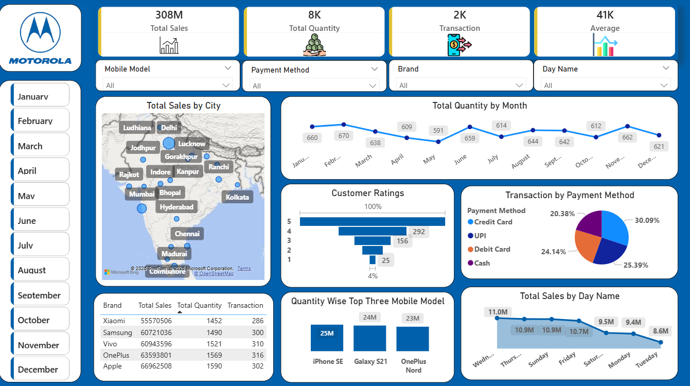

📊 Mobile Sales Dashboard – Power BI
📌 Project Overview

This project presents an interactive Mobile Sales Dashboard built using Power BI to analyze sales performance across cities, brands, and time periods.

📂 Files Included

-Mobile_Sales_Dashboard.pbix – Power BI report file
-Mobile Sales Data.xlsx – Raw dataset
-Dashboard_Screenshot.png – Dashboard preview

📈 Dashboard Features

-KPI Cards (Total Sales, Quantity, Transactions, Average)
-Sales by City (Map Visualization)
-Monthly Sales Trend
-Payment Method Distribution
-Customer Ratings Analysis
-Brand-wise Performance Table
-Day-wise Sales Trend

🛠 Tools & Technologies

-Power BI
-Excel
-DAX

📷 Dashboard Preview

